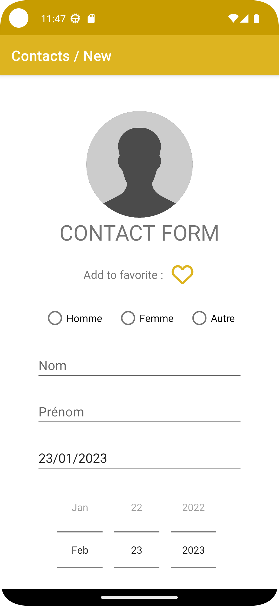

# Contact_app

## Project presentation

This application is a contact management app developped with Android Studio in kotelin. I developped this app during my second year of BUT info at [IUT Lyon 1](https://iut.univ-lyon1.fr/). 
The app allow the user to create neww contacts, manage them (edit, delete, add to favorite).

## Try it now

You can clone the repository and launch it in the Android Studio app to edit it directely or even run right away on your android smartphone.

## Visuals of the application

 - This is the main screen of the application, it shows all the contacts and all the parameters to manage the contacts :
 
    

- Here is also a visuel of one contact selected withe the buttons edit, delete and add to favorite :

    
    
- Here is finally a visual of the add new contact page with all the parameters of the contact :

    
    

## Authors

**Mathis Guerin**

- [ ] [My GitHub](https://github.com/Hubrec)
- [ ] [My Linkedin](https://www.linkedin.com/in/mathis-guerin-43b228222/)

## License

This project is under a MIT licence.

## Project status

The development of the project is open and still in developpement
